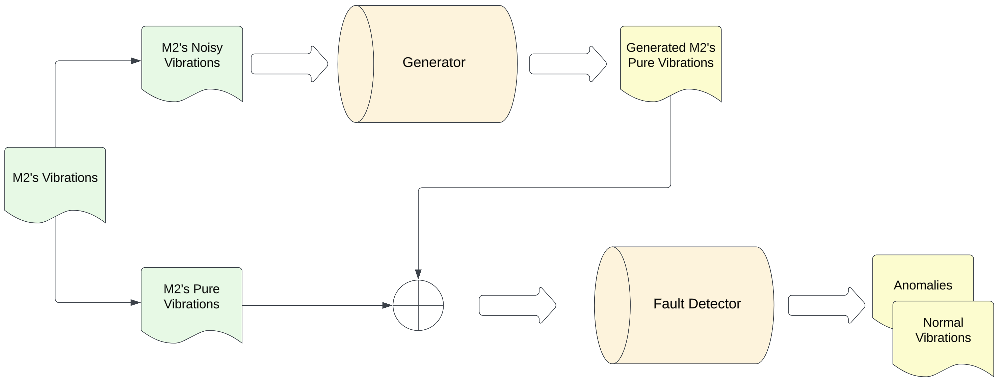

# Fault Detection in Factory Machines

Fault detection in factory machines using vibration data analytics

## Background
Factory machines are the backbone of the industrial sector. A fault in any of these machines can lead to substantial economic losses and even safety hazards. With the advent of Business Analytics, predictive maintenance has become a key strategy to prevent unplanned downtimes. Vibration data, in particular, can serve as an early warning system for potential faults.

## Objective
Using a dataset containing vibration data of various factory machines, our task is to design a solution that detects machine faults, thereby aiding in predictive maintenance.

## Overview of Model Methodology

## Presentation with Methodology
[final-presentation](./docs/final-presentation.pdf)
